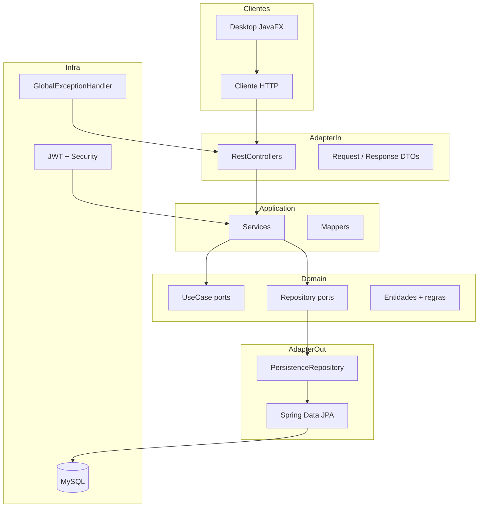

# TechFinance Pessoal — API

Documentação técnica e análise arquitetural do módulo `api` e do ecossistema TechFinance Pessoal.

---

## 1. Introdução e visão geral

O **TechFinance Pessoal** é um sistema de **finanças pessoais** em Java, organizado como **monorepo Maven multi-módulo** (`pessoal`). O objetivo do projeto é unificar várias interfaces (desktop, API REST e, no futuro, web) sobre o mesmo ecossistema de negócio.

Hoje o ecossistema tem dois módulos ativos:

| Módulo   | Papel          | Stack                                      |
|----------|----------------|--------------------------------------------|
| `api`    | Backend REST   | Spring Boot 3.5.9, Java 17, JPA, MySQL, JWT |
| `desktop`| Cliente gráfico| JavaFX 17, OkHttp → consome a API          |

O roadmap prevê módulos separados (`domain`, `application`, `infrastructure`) e compartilhamento real de regras de negócio — hoje isso **ainda não existe**; a API concentra domínio, aplicação e infraestrutura no mesmo módulo.

---

## 2. Negócio e domínio

### O que o sistema faz

É um **controle financeiro pessoal multi-usuário**. Cada usuário gerencia:

1. **Usuários** — cadastro com username, senha (BCrypt) e papel (`USER` / `ADMIN`)
2. **Contas** — carteiras com saldo inicial e tipo (`CHECKING`)
3. **Categorias** — classificação de transações (única por usuário + nome)
4. **Transações** — receitas (`INCOME`) ou despesas (`EXPENSE`) que alteram o saldo da conta

### Regras de negócio principais

- **Saldo na entidade `Account`** — crédito/débito e validação de saldo insuficiente ficam no domínio (`Account.applyTransaction()`)
- **Isolamento por usuário** — contas, categorias e transações são filtradas pelo usuário autenticado (`AuthenticatedUserContext`)
- **Atomicidade** — criação de transação usa `@Transactional`: valida conta/categoria, aplica saldo, persiste conta + transação
- **Unicidade** — categoria única por `(usuario_id, nome)`

### Modelo de dados

| Entidade      | Tabela       | Relacionamentos              |
|---------------|--------------|------------------------------|
| `User`        | `usuarios`   | —                            |
| `Account`     | `contas`     | N:1 com `User`               |
| `Category`    | `categorias` | N:1 com `User`               |
| `Transaction` | `transacoes` | N:1 com `Account` e `Category` |

Todas herdam `EntityBase` (UUID, `createdAt`, `updatedAt`).

---

## 3. Arquitetura e fluxos

### Estrutura por bounded context

A API segue **Arquitetura Hexagonal (Ports & Adapters)** organizada por contexto:

```text
api/
├── account/          → finanças (conta, categoria, transação)
│   ├── adapter/in/   → controllers, DTOs
│   ├── adapter/out/  → repositórios de persistência
│   ├── application/  → services, mappers
│   └── domain/       → model, enums, ports
├── auth/             → autenticação (login, registro, JWT)
├── user/             → gestão de usuários
└── infra/            → cross-cutting (security, JPA, exceptions)
```

### Diagrama de camadas



### Fluxo: criar transação

```text
POST /api/v1/transaction/create
  → TransactionRestController
    → TransactionService (@Transactional)
      → AuthenticatedUserContext.getCurrentUserId()
      → AccountRepository.findByIdAndUserId()   // ownership
      → CategoryRepository.findByIdAndUserId()  // ownership
      → Account.applyTransaction()              // regra de saldo
      → AccountRepository.save()
      → TransactionRepository.save()
    → TransactionResponse.from(result)
```

### Fluxo: autenticação

```text
POST /api/v1/auth/login
  → AuthRestController
    → AuthService
      → AuthenticationManager (Spring Security)
      → UserUseCase.byUsername()
      → JwtService.generateToken()
    → AuthResponse
```

### Endpoints

Base path: `/api/v1`

| Método | Endpoint              | Auth   | Função              |
|--------|-----------------------|--------|---------------------|
| POST   | `/auth/register`      | Público| Registro + JWT      |
| POST   | `/auth/login`         | Público| Login + JWT         |
| POST   | `/user/create`        | Público| Criar usuário       |
| GET    | `/user/{username}`    | JWT    | Buscar usuário      |
| GET    | `/account`            | JWT    | Listar contas       |
| POST   | `/account/create`     | JWT    | Criar conta         |
| GET    | `/account/{id}`       | JWT    | Buscar conta        |
| GET    | `/category`           | JWT    | Listar categorias   |
| POST   | `/category/create`    | JWT    | Criar categoria     |
| GET    | `/transaction`        | JWT    | Listar transações   |
| POST   | `/transaction/create` | JWT    | Criar transação     |

Payloads JSON em português (`nome`, `saldo`, `id_conta`, `ocorreu_em`).

Autenticação via header: `Authorization: Bearer <token>`.

---

## 4. Integrações e dependências

### Integrações externas

| Integração        | Uso                    | Configuração                          |
|-------------------|------------------------|---------------------------------------|
| **MySQL**         | Persistência           | `jdbc:mysql://localhost:3306/techfinance` |
| **JWT (jjwt)**    | Autenticação stateless | `jwt.secret`, `jwt.expiration` (1h)   |

Não há integrações com: Open Banking, pagamentos, e-mail, cache, filas ou cloud.

### Dependências Maven

- `spring-boot-starter-web`, `security`, `data-jpa`, `validation`
- `spring-boot-starter-log4j2` (Logback excluído)
- `mysql-connector-j`
- `jjwt-api`, `jjwt-jackson`, `jjwt-impl`
- Lombok (parent POM)

### Cliente desktop

O módulo `desktop` usa **OkHttp + Jackson** para login/registro na API. É consumidor externo; não compartilha código de domínio com a API.

### Configuração e deploy

- Um único `application.yml` com credenciais e JWT secret hardcoded
- `ddl-auto: update` (schema gerenciado pelo Hibernate, sem migrations)
- Sem Docker, CI/CD, profiles (`dev`/`prod`) ou Actuator
- O README raiz menciona `GET /health`, mas esse endpoint **não existe** no código

---

## 5. Design patterns identificados

| Pattern                        | Onde / como                                                                 |
|--------------------------------|-----------------------------------------------------------------------------|
| **Hexagonal (Ports & Adapters)** | Pacotes `adapter/in`, `application`, `domain`, `adapter/out`              |
| **Use Case**                   | `*UseCase` (port in) + `*Service` (implementação)                          |
| **Repository**                 | `*Repository` → `*PersistenceRepository` → `*PersistenceSpring` (JPA)      |
| **DTO / Record**               | Request/Response com `@JsonProperty` PT-BR                                 |
| **Mapper / Template Method**   | `MapperConverter` com hooks `doToEntity`, `doToResult`, `doToResponse`     |
| **Result objects**             | `AccountResult`, `TransactionResult`, `AuthResult`                         |
| **Filter Chain**               | `JwtAuthenticationFilter`                                                  |
| **Strategy (DI)**              | Interfaces injetadas via construtor (`@RequiredArgsConstructor`)           |
| **Global Exception Handler**   | `@RestControllerAdvice`                                                    |
| **Rich Domain (parcial)**      | `Account.applyTransaction()`                                               |
| **Builder**                    | Lombok `@Builder` em entidades e results                                   |

---

## 6. Análise: Clean Architecture

### O que está bem alinhado

- Separação clara **adapter → application → domain → adapter out**
- **Ports de saída** (`AccountRepository`, etc.) desacoplam services da JPA
- **Bounded contexts** (`account`, `auth`, `user`) com responsabilidades distintas
- Regra crítica de saldo no domínio, não no controller
- Infraestrutura (`infra/`) isolada como cross-cutting

### Violações e gaps

| Problema | Impacto |
|----------|---------|
| Entidades de domínio com JPA (`@Entity` em `domain/model`) | Domínio acoplado ao Hibernate |
| Ports "in" referenciam DTOs HTTP (`AccountUseCase.create(AccountRequest)`) | Domínio conhece adapter de entrada |
| Exceções de infra nos ports (`BusinessErrorException`, etc.) | Domínio depende de infra |
| Sem módulo `domain` compartilhado | Desktop e API duplicam DTOs |
| Controllers injetam `*Service` concreto | Quebra inversão de dependência |
| `AuthCommand` órfão | Interface antiga não utilizada |

### Score estimado

| Critério                     | Nota (0–10) | Comentário                              |
|------------------------------|-------------|-----------------------------------------|
| Separação de camadas         | 7           | Estrutura boa, acoplamentos pontuais    |
| Regra de dependência         | 5           | DTOs e JPA no domínio quebram o ideal   |
| Independência de framework   | 4           | Forte acoplamento a Spring/JPA          |
| Testabilidade                | 3           | Sem testes; domínio difícil de isolar   |
| Evolução para módulo `domain`| 6           | Base existe, falta extrair              |

**Veredicto:** hexagonal pragmática, não Clean Architecture estrita. Boa base educacional, mas ainda é "Clean Architecture de pasta", não de dependências reais.

---

## 7. Análise: SOLID

### S — Single Responsibility (parcial)

- Cada service tem responsabilidade clara (conta, transação, auth)
- `GlobalExceptionHandler` centraliza erros HTTP
- Services repetem blocos `try/catch` quase idênticos

### O — Open/Closed (parcial)

- Novos adapters podem implementar `*Repository`
- Novos casos de uso exigem alterar interface + service + controller

### L — Liskov Substitution (atenção)

- `*PersistenceRepository` implementa ports corretamente
- Controllers dependem de classes concretas (`AccountService`)

### I — Interface Segregation

- Ports enxutos (`AccountUseCase` com 3 métodos)
- `AuthCommand` vs `AuthUseCase` sugere refatoração incompleta

### D — Dependency Inversion (atenção)

- **Bom:** services dependem de `AccountRepository`, `TransactionRepository`
- **Ruim:** controllers → `AccountService`; ports in → DTOs; domain → JPA

---

## 8. Análise: Clean Code

### Pontos positivos

- Nomes em português consistentes com o domínio
- Uso de `record` para DTOs imutáveis
- Logging estruturado com Log4j2 e `LogMessages`
- Validação com `@RequiredField` customizado
- Constructor injection via `@RequiredArgsConstructor`

### Pontos a melhorar

| Issue | Exemplo |
|-------|---------|
| Try/catch repetitivo | Padrão idêntico em todos os services |
| Inconsistência de contrato | `AccountRequest.userId` obrigatório, mas ignorado pelo service |
| Bug no mapper | `AccountMapper.doToResult` não popula `userId` |
| Código morto | `AuthCommand` importado mas não usado |
| Controllers acoplados | Injeta service em vez de use case |
| CORS `*` | Em todos os controllers |
| Formatação irregular | `AccountService.java` com linhas em branco excessivas |

---

## 9. Melhorias sugeridas

### Críticas (fazer primeiro)

1. **Testes automatizados** — unitários e de integração (transação + saldo, JWT, ownership)
2. **Corrigir bugs de contrato** — `AccountRequest.userId` e mapper de `userId`
3. **Secrets e profiles** — `application-dev.yml` / variáveis de ambiente
4. **Migrations** — Flyway ou Liquibase em vez de `ddl-auto: update`
5. **Endpoint `/health`** — implementar ou remover do README raiz

### Arquitetura

6. **Commands no domínio** — `CreateAccountCommand` em vez de `AccountRequest` nos ports
7. **Entidades JPA separadas** — `AccountEntity` em `adapter/out` + `Account` puro no domain
8. **Controllers → `*UseCase`** — respeitar inversão de dependência
9. **Remover `AuthCommand`** — código morto
10. **Extrair módulo `domain`** — compartilhar entre API e desktop

### Qualidade e operação

11. **AOP ou decorator** para tratamento de exceções nos services
12. **OpenAPI/Swagger** — documentação viva dos endpoints
13. **Spring Actuator** — health, metrics
14. **CORS configurável** — via `SecurityConfig`
15. **CI/CD** — build + testes no push

### Segurança

16. Refresh token ou rotação de JWT
17. Rate limiting em login/register
18. Validar tamanho/força de senha
19. Revisar exposição de `GET /user/{username}`

---

## 10. Funcionalidades a levantar

### CRUD incompleto

- Update/delete de contas, categorias e transações
- Estorno/reversão de transação (com recálculo de saldo)
- Transferência entre contas do mesmo usuário

### Relatórios e visão financeira

- Dashboard — saldo total, receitas vs despesas no período
- Extrato por conta com filtros (data, categoria, tipo)
- Resumo mensal/anual por categoria
- Gráficos (pie chart por categoria, evolução de saldo)

### Recorrência e planejamento

- Transações recorrentes (aluguel, salário)
- Orçamento por categoria com alertas de limite
- Metas financeiras (economizar X até data Y)

### Multi-conta e tipos

- Mais tipos de conta (`SAVINGS`, `CREDIT_CARD`, `INVESTMENT`)
- Cartão de crédito com fatura e limite
- Moedas e conversão

### Investimentos (roadmap desktop)

- Carteira de investimentos
- Cotação de ativos (integração externa)
- Rentabilidade

### Infra e produto

- Notificações (e-mail/push)
- Exportação CSV/PDF
- Backup/restore de dados
- Conta conjunta / compartilhamento familiar
- Auditoria — log de alterações em transações
- 2FA para login

### Desktop (integração)

- Telas de wallet, transações, dashboard consumindo novos endpoints
- Cache local offline (sync quando online)

---

## 11. Como executar

### Pré-requisitos

- Java 17+
- Maven 3.9+
- MySQL com database `techfinance`

### Compilar e executar

Na raiz do monorepo:

```bash
mvn clean install
mvn -pl api spring-boot:run
```

A API sobe em `http://localhost:8080`.

### Tratamento de erros HTTP

| Exceção                        | HTTP |
|--------------------------------|------|
| `UnauthorizedErrorException`   | 401  |
| `NotFoundErrorException`       | 404  |
| `BusinessErrorException`       | 422  |
| `UnexpectedErrorException`     | 500  |
| `MethodArgumentNotValidException` | 400 |

---

## 12. Resumo executivo

| Aspecto          | Situação atual                                              |
|------------------|-------------------------------------------------------------|
| **Propósito**    | Finanças pessoais multi-usuário                             |
| **Arquitetura**  | Hexagonal por bounded context — boa base, não Clean pura    |
| **SOLID**        | DI nos repositórios ✅; ports com DTOs HTTP ⚠️              |
| **Clean Code**   | Legível e consistente; repetição e inconsistências          |
| **Design Patterns** | Repository, Use Case, Mapper, DTO bem aplicados        |
| **Testes**       | Inexistentes — maior gap                                    |
| **Produção**     | Não pronto (secrets, migrations, health, CORS)              |

---

## Autor

Projeto desenvolvido por João Vitor Oliveira Mamede.
